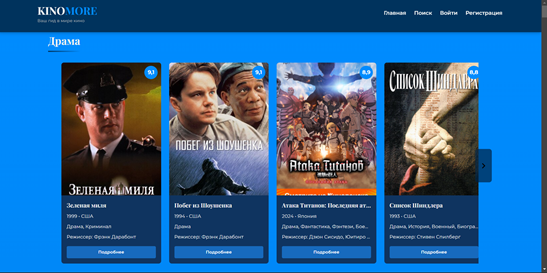
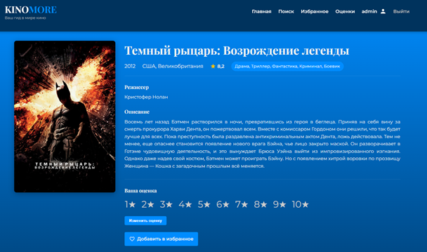
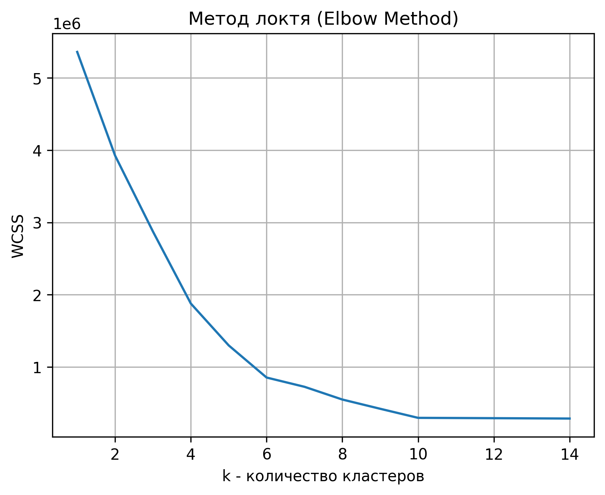
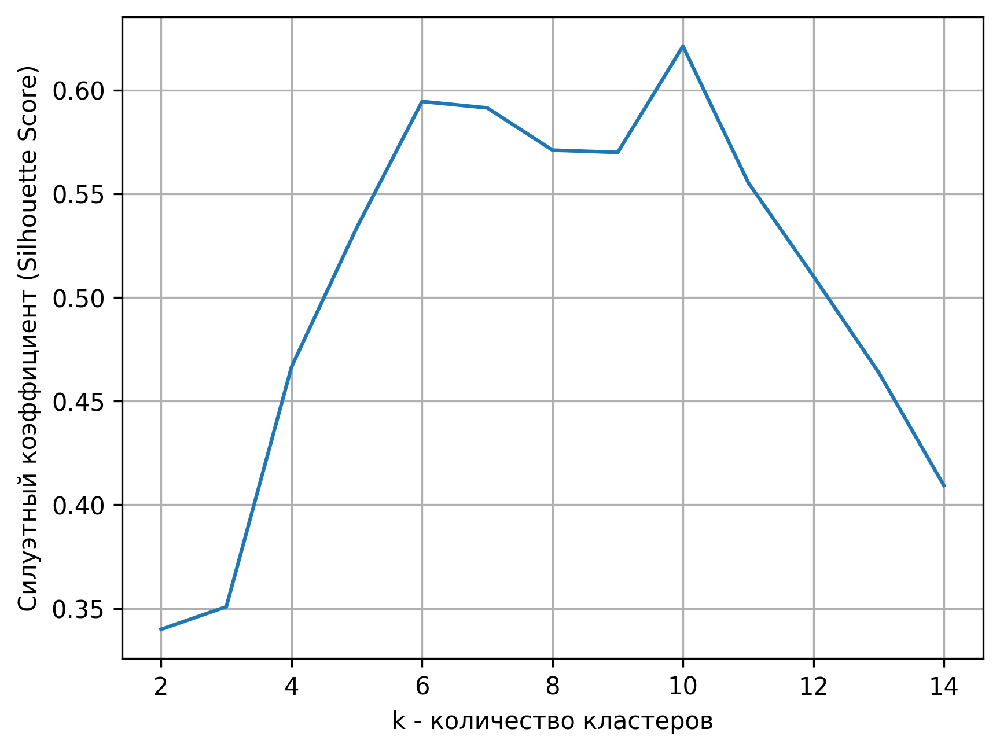
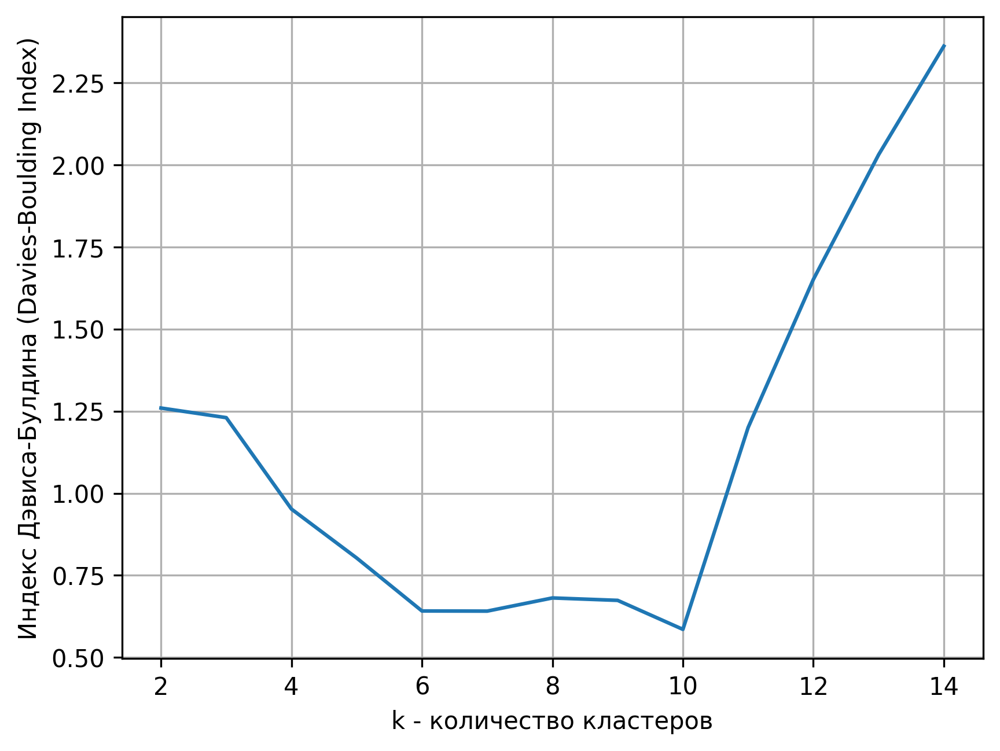
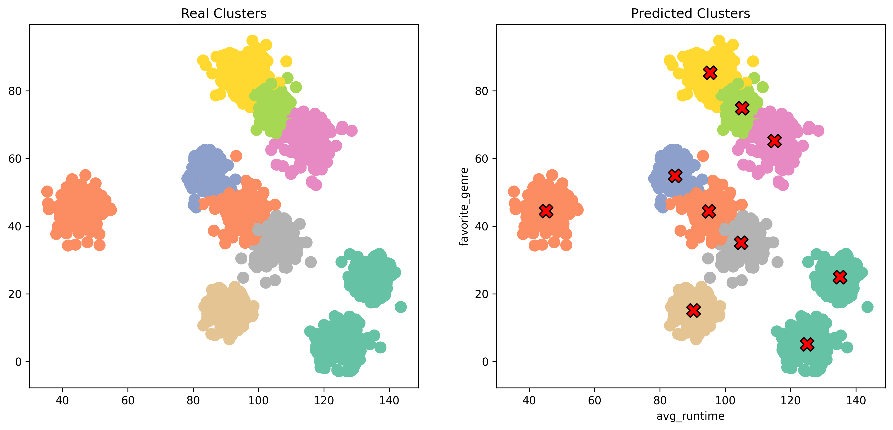
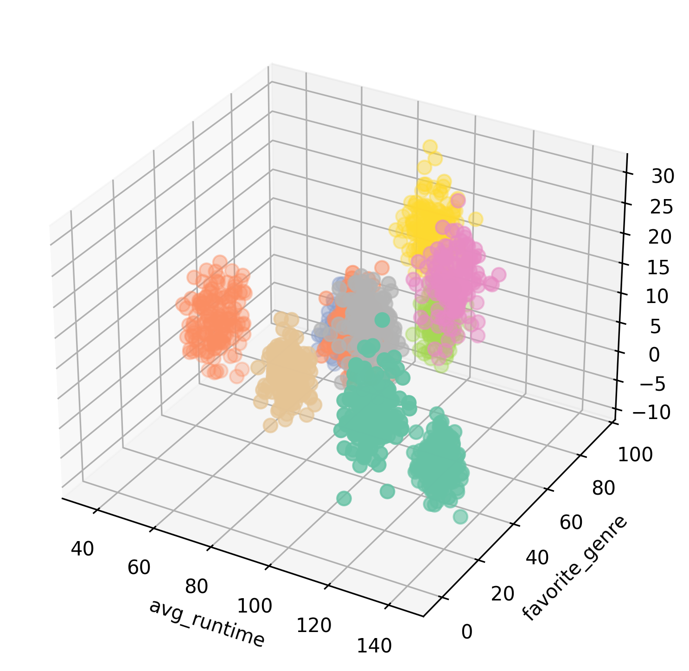

# Интеллектуальная система рекомендаций для просмотра кинофильмов

Веб-приложение на Django, реализующее три подхода к формированию рекомендаций: content-based фильтрацию, 
user-based коллаборативную фильтрацию и семантический поиск на основе дообученной модели rubert-tiny2.


## Содержание
- [О проекте](#интеллектуальная-система-рекомендаций-для-просмотра-кинофильмов)
- [Скриншоты](#скриншоты)
- [Функциональность](#функциональность)
- [Установка и запуск](#установка-и-запуск)
- [Рекомендательные системы](#рекомендательные-системы)
- [Структура проекта](#структура-проекта)

## Скриншоты

<div align="center">
  <table>
    <tr>
      <td align="center">
        
        <br/>
        <b>Главная страница</b>
      </td>
      <td align="center">
        
        <br/>
        <b>Страница фильма</b>
      </td>
    </tr>
    <tr>
      <td align="center">
        
        <br/>
        <b>Профиль пользователя</b>
      </td>
      <td align="center">
        
        <br/>
        <b>Семантический поиск</b>
      </td>
    </tr>
  </table>
</div>

## Функциональность
* Регистрация и авторизация пользователей
* Каталог фильмов с фильтрацией по жанрам и сортировкой
* Оценка фильмов
* Добавление фильмов в избранное и их удаление
* Добавление друзей, просмотр чужих оценок и избранного
* Content-based рекомендации на основе жанров, режиссёров и стран
* User-based коллаборативные рекомендации на основе схожести пользователей
* Семантический поиск на русском языке

## Стек технологий
* Бэкенд: Django 5.1.6, Python 3.12
* База данных: PostgreSQL
* Frontend: HTML, CSS, JavaScript, Bootstrap
* Машинное обучение: scikit-learn, pandas, numpy
* Семантический поиск: PyTorch, sentence-transformers, FAISS
* Нейросетевая модель: [rubert-tiny2 (дообученная)](https://huggingface.co/cointegrated/rubert-tiny2)

## Установка и запуск
1. Клонирование репозитория
```bash
git clone https://github.com/AlexanderSh11/films_app.git
cd films_app
```
2. Создание и активация виртуального окружения
```bash
python -m venv .venv
source .venv/bin/activate  # Linux/Mac
.venv\Scripts\activate     # Windows
```
3. Установка зависимостей
```bash
pip install -r requirements.txt
```
4. Настройка базы данных  
Создайте базу данных PostgreSQL и настройте подключение. Создайте файл .env на основе .env-example
5. Миграции
```bash
python manage.py migrate
```
6. Запуск сервера
```bash
python manage.py runserver
```
Первый запуск может быть долгим, поскольку модель семантического поиска будет дообучаться на ваших данных из БД, если они есть.  
## Рекомендательные системы
### 1. Content-based фильтрация

Класс: MovieRecommender в content_based.py

Принцип работы:  
Система анализирует фильмы, которые пользователь оценил или добавил в избранное. 
Для каждого признака (жанр, режиссёр, страна) рассчитывается вес на основе оценок. 
Затем для всех фильмов, не добавленных в избранное, вычисляется score и выдаётся топ-N.

Коэффициенты весов:
* Жанры: 0.6
* Режиссёры: 0.4
* Страны: 0.3
* Рейтинг фильма: rating / 10

Минимальный порог: 10 взаимодействий (оценок или избранного).  
### 2. User-based коллаборативная фильтрация

Класс: MovieRecommender в content_based.py

Принцип работы:  
Система находит пользователей со схожими предпочтениями (косинусная схожесть) и 
на основе их оценок предсказывает оценки для целевого пользователя.

Были сравнены два алгоритма предсказания оценки:
- Базовый (наивный)
- Усовершенствованный (с нормализацией оценок)

**Базовый алгоритм**  
Предсказанная оценка *r* для пользователя *u* и фильма *i* вычисляется как среднее арифметическое оценок,
которые поставили этому фильму *N* самых похожих пользователей. Формулы предсказания оценки фильма представлены в [статье](https://makesomecode.me/2018/09/movie-recommendation-system/)

*Недостаток:* не учитывает, что разные пользователи используют шкалу оценок по-разному (один ставит 10 всем фильмам, другой — 5). 
Это приводит к систематическому завышению оценок.

**Усовершенствованный алгоритм**  
В усовершенствованном алгоритме используется косинусная схожесть пользователей. Сначала вычисляется средняя оценка пользователя, 
а затем каждая оценка нормализуется путём вычитания этого среднего.

Взвешенное среднее отклонений оценок пользователя от его средней оценки прибавляется к средней оценке целевого пользователя.

**Результаты сравнения:**

| Метрика	                              | Базовый алгоритм | Усовершенствованный |
|:-------------------------------------:|:----------------:|:-------------------:|
| RMSE                                	| 4.98             | 1.22                |
| Доля точных предсказаний (ошибка < 1) |	2.7%	           | 81.1%               |

Синтетические пользователи в количестве 1500 были сгенерированы с помощью make_blobs(), разбиты на 6 кластеров 
(Анализ качества генерации и кластеризации был проведен с помощью метод локтя, индекс Дэвиса-Болдуина, силуэтный анализ).

| Метод локтя                      | Силуэтный анализ                          | Индекс Дэвиса-Болдуина                              |
|:--------------------------------:|:-----------------------------------------:|:---------------------------------------------------:|
|  |  |  |

## Визуализация пользователей

| 2D сравнение                                       | t-SNE 2D                          | t-SNE 3D                          | 3D визуализация               |
|:--------------------------------------------------:|:---------------------------------:|:---------------------------------:|:-----------------------------:|
|  |  |  |  |

### 3. Семантический поиск
Модель: [cointegrated/rubert-tiny2](https://huggingface.co/cointegrated/rubert-tiny2)(российская модель от SberDevices).

Датасет для дообучения: 797 фильмов с текстовыми представлениями (название, жанры, режиссёры, страны, описание).

Функция потерь: MultipleNegativesRankingLoss.

Эпохи: 6, 10, 20, 30.

Результаты дообучения:

| Метрика | 6 эпох | 10 эпох | 20 эпох | 30 эпох | Изменение |
|:--------|-------:|--------:|--------:|--------:|----------:|
| Accuracy@1 | 0.440 | 0.450 | 0.486 | 0.510 | **+15.9%** |
| Precision@1 | 0.440 | 0.450 | 0.486 | 0.510 | **+15.9%** |
| Recall@1 | 0.440 | 0.450 | 0.486 | 0.510 | **+15.9%** |
| F1@1 | 0.440 | 0.450 | 0.486 | 0.510 | **+15.9%** |
| Accuracy@3 | 0.588 | 0.630 | 0.652 | 0.668 | **+13.6%** |
| Precision@3 | 0.196 | 0.210 | 0.217 | 0.223 | **+13.8%** |
| Recall@3 | 0.588 | 0.630 | 0.652 | 0.668 | **+13.6%** |
| Accuracy@5 | 0.644 | 0.682 | 0.718 | 0.738 | **+14.6%** |
| Precision@5 | 0.129 | 0.136 | 0.144 | 0.148 | **+14.7%** |
| Recall@5 | 0.644 | 0.682 | 0.718 | 0.738 | **+14.6%** |
| Accuracy@10 | 0.748 | 0.792 | 0.822 | 0.846 | **+13.1%** |
| Precision@10 | 0.075 | 0.079 | 0.082 | 0.085 | **+13.3%** |
| Recall@10 | 0.748 | 0.792 | 0.822 | 0.846 | **+13.1%** |
| NDCG@10 | 0.583 | 0.613 | 0.643 | 0.664 | **+13.9%** |
| MRR@10 | 0.531 | 0.557 | 0.587 | 0.608 | **+14.5%** |
| MAP@100 | 0.543 | 0.567 | 0.597 | 0.615 | **+13.3%** |
| Training Loss | 1.663 | 1.473 | 1.215 | 1.002 | **-39.7%** |

FAISS-индекс используется для быстрого поиска по предвычисленным эмбеддингам всех 797 фильмов.

## Структура проекта

films_app/  
├── app/                          # Основное приложение Django  
│   ├── models.py                 # Модели базы данных  
│   ├── views.py                  # Представления  
│   └── templates/                # HTML-шаблоны  
├── accounts/                     # Приложение для аутентификации  
├── content_based.py              # Content-based рекомендации  
├── collaborative_filtering.py    # User-based коллаборативная система  
├── movie_searcher.py             # Семантический поиск  
├── generating_synthetic_users.py # Генерация синтетических пользователей  
├── .env                          # Переменные окружения проекта  
├── requirements.txt              # Зависимости проекта  
└── manage.py                     # Django управляющий скрипт  
